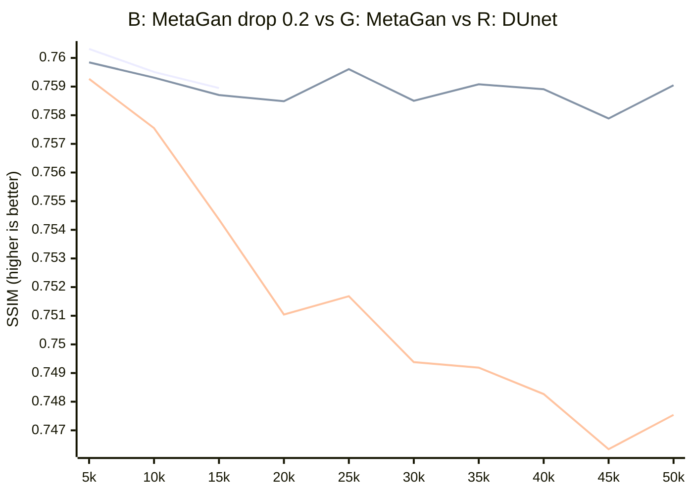

# MetaGan.
This project was developed based on the idea that for the GAN loss function, only a single value is needed—indicating either high or super resolution (HR or SR). Therefore, an attempt was made to implement the loss function using binary classification. As a result, this approach proved to be viable, increasing network stability and enabling the use of more advanced techniques to enhance discriminator performance, with only a minimal increase in memory and computational costs.

## Config:

net_g: Span

manual_seed: 1234

loss: perceptual(vgg19) * 0.035 + Mssim_l1_alpha_0.1 + Gan*0.1

train_dataset: df2k

val_dataset: urban100

train_framework: NeoSR

## MetaGan:
- In Shape: [2, 3, 512, 512]
- Out Shape: [2, 1]
- Mean iter time: 15.02ms
- Max Memory: 1275.43[M]
- Parameters: 8041.35K
## DUnet:
- In Shape: [2, 3, 512, 512]
- Out Shape: [2, 1, 512, 512]
- Mean iter time: 58.57ms
- Max Memory: 3385.33[M]
- Parameters: 3231.46K
